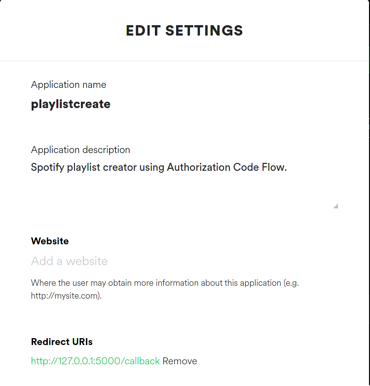
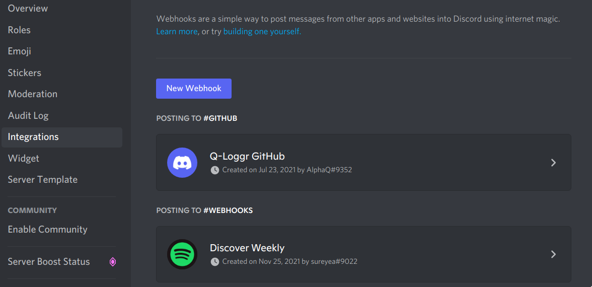
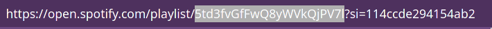

# SpotWeekly
Automate saving your Discover Weekly Playlist using Python.
Made with <3 and FastAPI.  
The saved playlist link is sent to my discord server via a webhook.

## Installation
Clone this repository.  
```bash
git clone https://github.com/shouryade/SpotWeekly
```
This project uses `pipenv` to create a virtual environment.
```bash
pip install pipenv
```
Activate and install dependencies using pipenv.
```bash
cd SpotWeekly
pipenv sync 
```
For `venv` enthusiasts, I have provided a `requirements.txt` file to help install project dependencies.   

Rename the `env.example` file to **`.env`**.
## Setup
<details>
<summary>Registering Your Spotify App on Spotify for Developers </summary>
<br>
<li>Create a <a href='https://developer.spotify.com/dashboard/applications'>Spotify Developer</a> account.</li>
<li>Copy the Client ID and Client SECRET and paste it in the .env file.</li>
<li>Go to edit settings and set Redirect URI to <i>http://127.0.0.1:5000/callback</i> as shown</li>
<br>

</details>
<details>
<summary>Setting up webhook for Discord</summary>
<br>
<li>You need to have the <b>create and manage webhook</b> permissions in the server.</li>
<li>Go to Server Settings > Integrations > New Webhook </li>
<l1>Fill the required values and select the channel for the webhook to be posted in. </l1>
<li>Click on <i>Copy Webhook URL</i></li>

<li>Paste the copied url in .env file.</li>
</details>
<br>

## Usage
To get the playlist ID for your Discover Weekly, copy the link for the playlist.  
The highlighted portion as shown in the image is the Spotify Playlist ID.

   
Extract the ID and paste it onto the **`.env`** file.  
Fill the remaining details in the **`.env`** file.  
<br>
Run `app.py` and copy the token supplied.
Run `main.py` and supply the parameters asked.  
Check Discord once `Successfully created playlist !` is printed on screen.  

## Roadmap
[ ] Create Docker instance.  
[ ] Run this as a cron job using Github Workflows.  
[ ] Create a bash script for a cron job if locally deployed.


## Contributing
Pull requests are welcome. For major changes, please open an issue first to discuss what you would like to change.  

